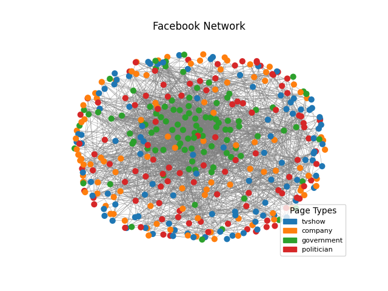
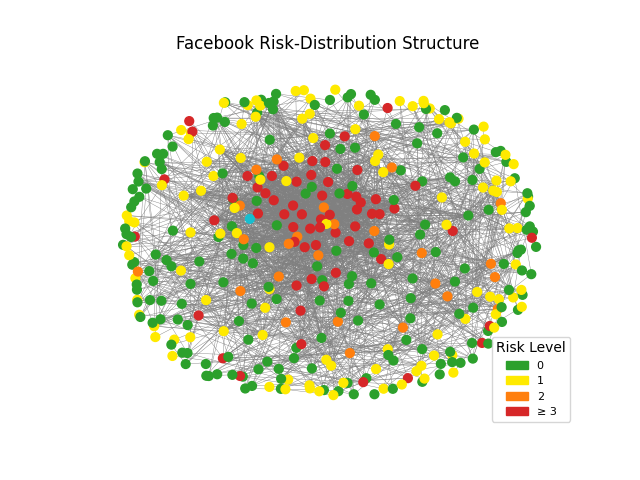
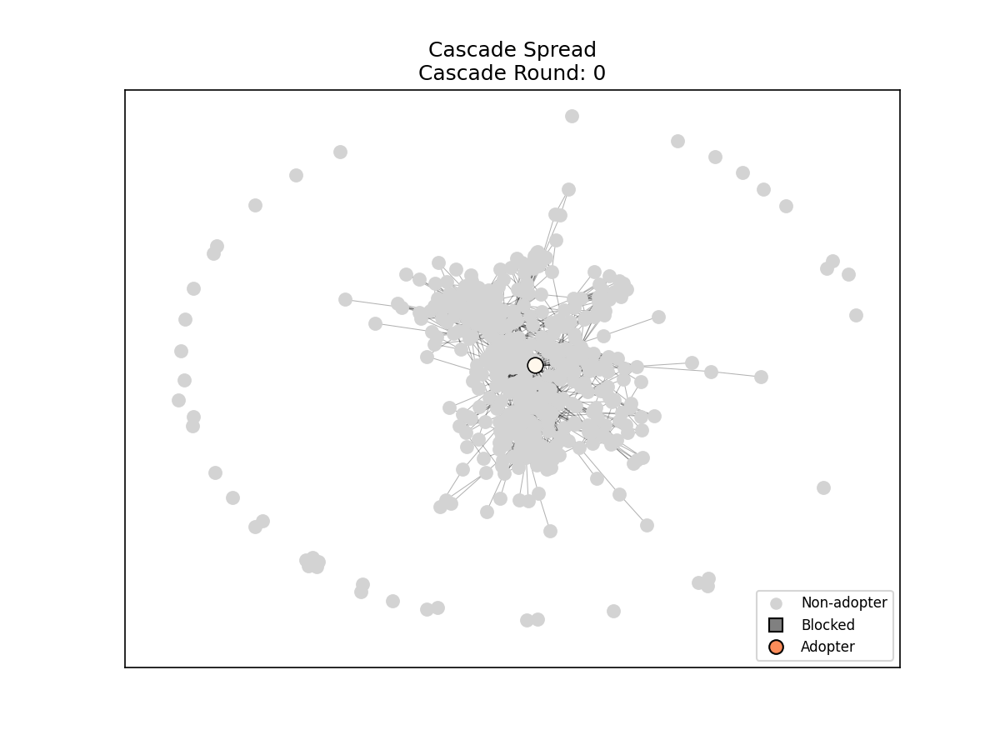
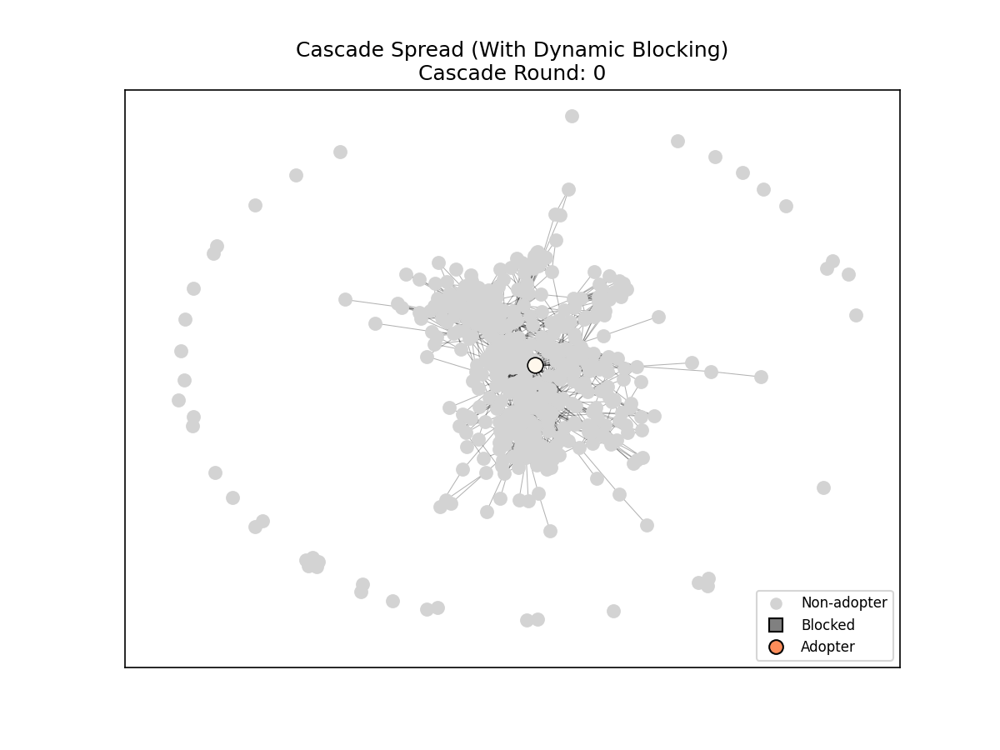

# Real-Life Social Network Challenge: Misinformation

[](https://www.python.org/)
[](https://matplotlib.org/)
[](https://networkx.org/)
[](https://numpy.org/)
[](https://pandas.pydata.org/)

### Team Members: TBA

## Description
This project analyzes real-world Facebook Page–Page networks to identify structural weak points that enable misinformation to spread through social graphs. Using graph-theoretic tools and network science techniques, the project constructs a full misinformation-risk assessment and structural analysis to identify where misinformation is most likely to originate from and spread.

## Requirements

- Python 3.10+
- Numpy
- NetworkX
- Matplotlib
- Pandas

All dependencies are listed in `requirements.txt`


## Usage Instructions
1. Download python from the official website [https://www.python.org/downloads/](https://www.python.org/downloads/) if you have not already done so.
2. Clone/download a copy of this repository.
3. Open your terminal and navigate to the project folder containing "`page_rank.py`".
4. Create a virtual environment within the folder by typing in `python -m venv venv` and pressing enter.
    - Confirm that the `venv/` folder exists with: `ls` for Linux/macOs or `dir` for Windows.
5. Activate the environment
    - On Windows, this is done via: `venv\Scripts\Activate`.
    - On Linux/macOS, this is done via: `source venv/bin/activate`.
6. Install the necessary packages with into the environment: `pip install -r requirements.txt`.
7. Run the program by running the example commands below.


### Commands

#### Normal Layout
*Command*:
```bash
python ./main.py data/facebook_large/musae_facebook_edges.csv --title "Facebook Network" --sample_size 400
```
*Description*: Generates graph consisting of the 400 highest-valued pages according to the PageRank algorithm.

- *Output*:



#### Bow-Tie Structure
*Command*:
```bash
python ./main.py data/facebook_large/musae_facebook_edges.csv --bow_tie --title "Facebook Bow-Tie Structure" --sample_size 400
```
*Description*: Generates 400-node graph colored based on how they fit into bow-tie structure.

- *Output*:


#### Risk Assessment
*Command*:

```bash
python ./main.py data/facebook_large/musae_facebook_edges.csv --risk_assessment --title "Facebook Risk-Distribution Structure" --sample_size 400
```
*Description*: Generates a 400-node graph colored based on how much of a hazard they represent as spreaders of misinformation.

- *Output 1*:



- *Output 2*:
```bash
=========== Graph Overview ===========
nodes: 400
edges: 2325
average_degree: 11.625
average_clustering: 0.346
largest_component_size: 366

=========== Core-Periphery ===========
max_k_core: 21
num_core_nodes: 33
top_core_nodes: [14497, 12464, 10426, 6441, 2442, 4502, 16895, 18966, 2596, 16977]

=========== Structural Weakpoints ===========
num_articulation_points: 24
num_bridges: 32
top_bridge_nodes: [(6174, 2), (20550, 2), (481, 2), (10857, 2), (15419, 2), (11507, 2), (18427, 2), (52, 1), (6206, 1), (2124, 1)]

=========== Influence ===========
top_pagerank: [(21729, 0.007636074556628897), (19743, 0.0076359637048122484), (701, 0.007151247266633645), (11003, 0.00709037568021191), (18952, 0.006729666125127268), (10426, 0.006716618324470428), (21120, 0.006229129033156406), (1387, 0.0059877923586631986), (16895, 0.0059709942373022415), (11507, 0.005912269470727401)]
top_betweeness: [(11003, 0.116606900192846), (701, 0.08919439283582346), (18819, 0.05396264684833749), (19743, 0.052513600731307924), (21729, 0.05230511425234946), (20083, 0.04761004845657377), (11158, 0.047375221256313944), (11507, 0.046966725170307345), (22171, 0.03944941461419854), (11611, 0.03878644363999343)]
top_degree: [(21729, 56), (19743, 56), (10426, 53), (1387, 51), (16895, 50), (5458, 49), (15236, 46), (6441, 44), (14497, 43), (10379, 42)]

=========== Risk Analysis ===========
average_risk: 1.16
max_risk: 8
top_risk_nodes: [1654, 10426, 21120, 4809, 11003, 21729, 11507, 19743, 21955, 18216]

=========== Echo Chambers ===========
top_clustering_nodes: [(4275, 1.0), (8417, 1.0), (10500, 1.0), (20990, 1.0), (4760, 1.0), (4826, 1.0), (4907, 1.0), (1193, 1.0), (13525, 1.0), (3300, 1.0)]
```

## Dynamic Blocking Intervention

To demonstrate how reactive moderation can contain misinformation spread, we implement a **dynamic blocking solution** that simulates real-time platform intervention.

### How Dynamic Blocking Works

Unlike static blocking (which pre-selects nodes before the cascade), dynamic blocking **reacts to the actual spread**:

1. **Detection Delay**: Platform detects adopters 1 round after they adopt (realistic detection lag)
2. **Degree-Priority**: Blocks highest-degree adopters first (super-spreaders)
3. **Budget-Respecting**: Never exceeds the specified blocking budget

```
Round 0: Seed node adopts
Round 1: N nodes adopt → Platform detects seed (skip - it's the source)
Round 2: M nodes adopt → Platform blocks highest-degree adopters from Round 1
Round 3: Fewer adopt   → Platform blocks highest-degree adopters from Round 2
...continues until cascade stalls or budget exhausted
```

### Blocking Commands

*Default (5% budget)*:
```bash
python ./main.py data/facebook_large/musae_facebook_edges.csv --cascade --block --sample_size 500
```

*Custom budget (20% with per-round limit)*:
```bash
python ./main.py data/facebook_large/musae_facebook_edges.csv --cascade --block --block_pct 0.2 --block_per_round 6 --sample_size 500
```

*Options*:
- `--block`: Enable dynamic blocking intervention
- `--block_pct 0.05`: Maximum fraction of nodes to block (default: 5%)
- `--block_per_round 3`: Max nodes to block per round (default: None = use entire budget ASAP)

### Expected Output

```
============================================================
DYNAMIC BLOCKING INTERVENTION
Budget: 20.0% of nodes
Per-round limit: 6 nodes
============================================================

>>> Running cascade WITHOUT blocking...

=========== Round 0 ===========
Previous adopters (1): [701]


=========== Round 1 ===========
Previous adopters (15): [14240, 22338, 13443, 9156, 325, 12677, 21572, 12521, 12203, 495]...


=========== Round 2 ===========
Previous adopters (47): [9858, 13443, 12677, 18040, 16400, 12177, 14228, 2837, 18079, 14240]...

Stopping cascade: adoption rate 0.228 >= threshold 0.1.

=========== Final Round 3 Adopters (114) ===========
Total adopters: 114

>>> Running cascade WITH dynamic blocking...

=========== Round 0 ===========
Previous adopters (1): [701]


=========== Round 1 ===========
Previous adopters (15): [14240, 22338, 13443, 9156, 325, 12677, 21572, 12521, 12203, 495]...

  [Dynamic] Blocked 6 high-degree adopters from round 1

=========== Round 2 ===========
Previous adopters (21): [12677, 16400, 12177, 18079, 12837, 12203, 2229, 18615, 701, 61]...

  [Dynamic] Blocked 6 high-degree adopters from round 2

=========== Round 3 ===========
Previous adopters (26): [18693, 12677, 8327, 909, 16400, 12177, 2323, 18079, 11809, 12203]...

  [Dynamic] Blocked 6 high-degree adopters from round 3

=========== Round 4 ===========
Previous adopters (26): [18693, 12677, 8327, 14981, 11917, 16400, 12177, 18079, 11809, 2597]...

  [Dynamic] Blocked 6 high-degree adopters from round 4
No new adopters in round 5. Cascade stalled.

=========== Final Round 4 Adopters (20) ===========
Total adopters: 20

============================================================
INTERVENTION COMPARISON
============================================================
Total nodes in graph:      500
Nodes blocked:             24 (4.8%)
Strategy:                  DYNAMIC (degree-priority)

────────────────────────────────────────────────────────────
WITHOUT BLOCKING:
  Final adopters:          114
  Adoption rate:           22.8%
  Cascade rounds:          3

────────────────────────────────────────────────────────────
WITH DYNAMIC BLOCKING:
  Final adopters:          20
  Adoption rate:           4.0%
  Cascade rounds:          4

────────────────────────────────────────────────────────────
EFFECTIVENESS:
  Adopters prevented:      94
  Reduction:               82.5%
============================================================
```

### Visualization

| Without Blocking | With Dynamic Blocking |
|:----------------:|:---------------------:|
|  |  |
| *114 adopters (22.8%)* | *20 adopters (4.0%)* |

In the animations:
- **Gray circles**: Non-adopters
- **Orange/red circles**: Adopters (darker = later rounds)
- **Gray squares**: Blocked nodes (with blocking only)

---

## Summary
This project analyzes Facebook Page–Page networks to identify structural vulnerabilities that enable misinformation to spread. Using core–periphery decomposition, articulation-point detection, centrality measures, and clustering analysis, the network is partitioned into meaningful structural regions such as core hubs, inner and outer shells, tubes, tendrils, and disconnected nodes. A custom misinformation risk score integrates influence and structural weakness indicators to highlight the highest-risk pages. Radial bow-tie visualization reveals how misinformation can flow from a dense internal core, through key structural bridges (tubes), and outward into peripheral communities. Overall, the project demonstrates how network structure shapes the propagation potential of misinformation in real social graphs.

Using a Linear Threshold cascade model, we simulate how misinformation spreads through the network from a high-risk source node. The cascade demonstrates the importance of network structure in enabling rapid information diffusion through peer influence.

The dynamic blocking intervention demonstrates that reactive moderation blocking high-degree spreaders as they are detected can dramatically reduce cascade spread, providing a realistic simulation of how platforms can contain misinformation in real-time.
